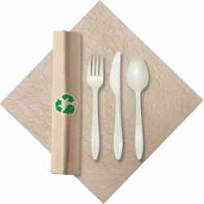
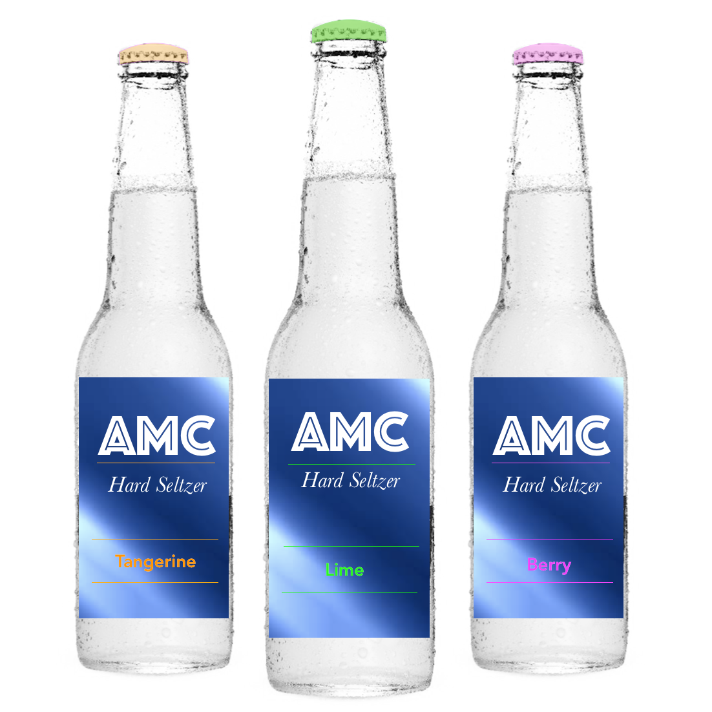
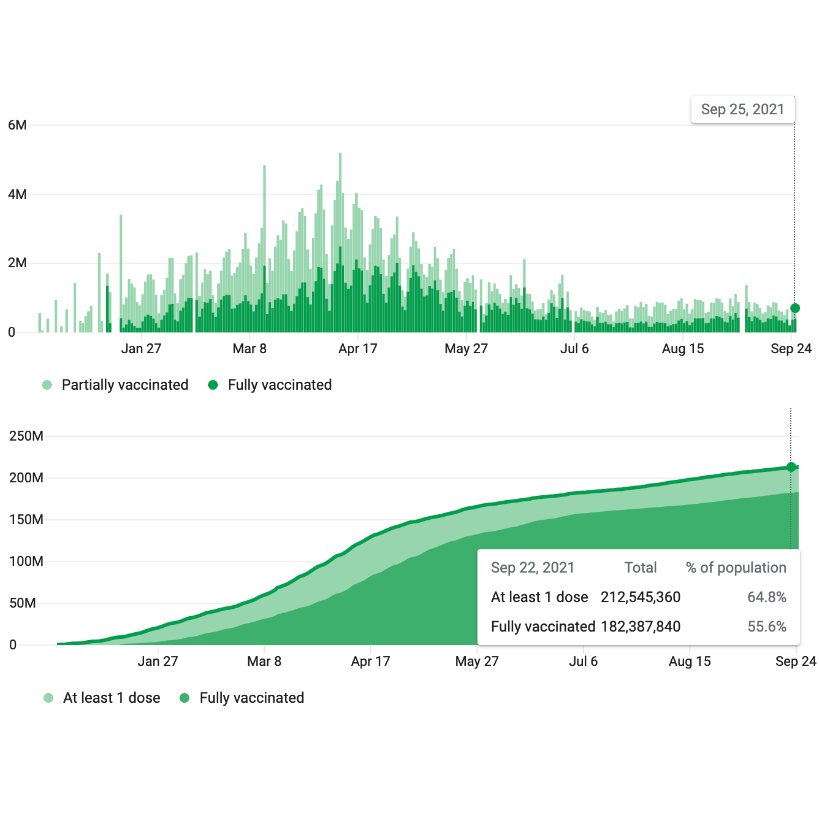

```{r setup, message=FALSE, warning=FALSE, include=FALSE}
library(metathis)

meta() %>%
  meta_description(
    'Showcase for Fall 2021 semester of "EMSE 6035: Marketing Analytics for Design Decisions" at GWU'
  ) %>%
  meta_name("github-repo" = "emse-madd-gwu/2021-Fall") %>%
  meta_viewport() %>%
  meta_social(
    title = "madd.seas.gwu.edu",
    url = "https://madd.seas.gwu.edu/2021-Fall",
    image = "https://madd.seas.gwu.edu/images/madd_hex_sticker.png",
    image_alt = "Hex sticker for class logo",
    og_type = "website",
    og_author = c("John Paul Helveston"),
    twitter_card_type = "summary",
    twitter_creator = "@JohnHelveston"
  )
```

<br>

<div class = "row"><div class = "col-md-5">

</div><div class = "col-md-7">
## [Omao Sustainable Plastic Cups](showcase/2021-Fall/omao-cups.html){target="_blank"}
by Arianna Haven, Isha Negi, Zachary Stecher, & Rishi Jarmarwala<br>
[<i class="fas fa-video"></i>](https://www.youtube.com/watch?v=yxuGpq7E1Ck){target="_blank"}<br>
</div></div>

<div class = "row"><div class = "col-md-5">

</div><div class = "col-md-7">
## [Omao Disposable Cutlery](showcase/2021-Fall/omao-cutlery.html){target="_blank"}
by Chi-Yun Chen, Laura Kadue, Weijie Pan, & Vyshaaly Sivakumaar<br>
</div></div>

<div class = "row"><div class = "col-md-5">

</div><div class = "col-md-7">
## [Preening Hand Sanitizer](showcase/2021-Fall/preening.html){target="_blank"}
by Tiffany Nguyen & Nicole Xie<br>
</div></div>

<div class = "row"><div class = "col-md-5">

</div><div class = "col-md-7">
## [AMC Seltzer: Revolutionizing the Hard Seltzer Surge](showcase/2021-Fall/seltzer.html){target="_blank"}
by Ariana Fazal, Myrto Kampouris, & Christian Lane<br>
</div></div>

<div class = "row"><div class = "col-md-5">

</div><div class = "col-md-7">
## [Consumer Preference Analysis for Used EVs](showcase/2021-Fall/used-ev.html){target="_blank"}
by Huajie Zhu, Mohammad Khan, Ruchi Saraf, Joey Shonubi, & Lujin Zhao<br>
</div></div>

<div class = "row"><div class = "col-md-5">

</div><div class = "col-md-7">
## [Moving the Needle: A comparison of different policy options to increase COVID-19 vaccination rates](showcase/2021-Fall/vaccine.html){target="_blank"}
by Neel Bhagwat & Jenny Kim<br>
[<i class="fas fa-video"></i>](https://www.youtube.com/watch?v=SvB-NBMEXfI){target="_blank"}<br>
</div></div>
